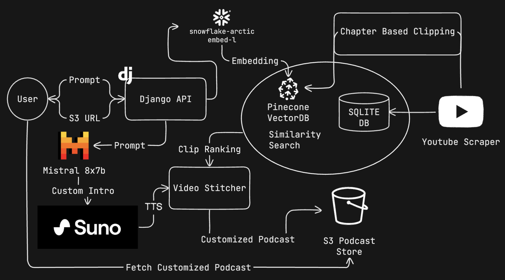

# Podlite 
**HackDartmouth 2024 Runner-Up**

Podlite is a customized podcast creator that take the best clips from your favorite podcasts and combines them into a single episode. Users can provide an LLM-style prompt to specify the topic of the episode, and Podlite will use a combination of NLP and audio processing to find the best clips that match the prompt. 

AI music and text-to-speech is used to introduce each new clip. 

## Stack:
- Frontend: Django 
- Backend: Flask
- Database: SQLLite, Pinecone, S3
- AI: Mistral8x7b, Snowflake Arctic Embed, Huggingface, Suno, Google Cloud TTS

## Architecture

